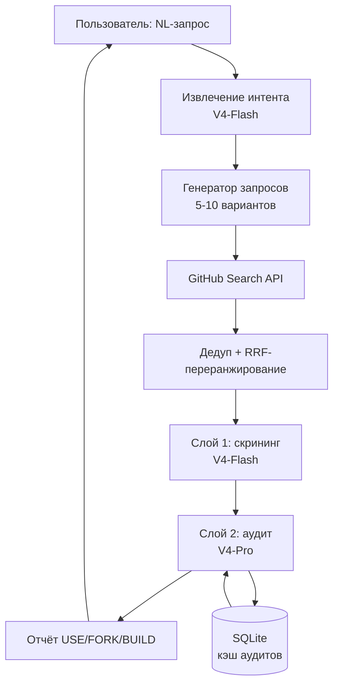

# ARCHITECTURE.md — архитектура MVP

**Сфера:** слои, потоки данных, границы ответственности.
**Обновлено:** 2026-09-03.

## Схема

Нумерация слоёв сквозная и единственная: **Слой 1 — скрининг, Слой 2 — аудит.**
Всё, что до Слоя 1 (интент, генерация запросов, поиск, RRF), — это *подготовка кандидатов*,
не отдельный слой. Слоя 0 и Слоя 3 в MVP нет.

## Границы

| Компонент | Модель | Вход | Выход | Лимит |
|---|---|---|---|---|
| Извлечение интента | V4-Flash | `ScanRequest` | `Intent` | 1 вызов |
| Генератор запросов | детерминированный код + `Intent` | `Intent` | `SearchQuerySet` | 5–10 запросов |
| Поиск | GitHub Search API | `SearchQuerySet` | сырые результаты | 30 результатов на запрос |
| Дедуп + RRF | детерминированный код | сырые результаты | `Candidate[]` | топ-50 |
| Слой 1 | V4-Flash | `Candidate[]` + README | `ScreeningResult` | 50 → 10 |
| Слой 2 | V4-Pro | топ-10 + дерево + манифесты | `AuditResult[]` | 10 → 5 |
| Отчёт | детерминированный код | `AuditResult[]` | `Report` | 5 кандидатов |

Все стыки описаны в `SCHEMAS.md`. Слой не имеет права принимать вход, не прошедший
валидацию по схеме, — падение на валидации предпочтительнее тихой деградации.

## Что каждый слой видит

**Слой 1 (скрининг, дёшево и много).** На вход — метаданные из `Candidate` и первые
4000 символов README. Задача — отсечь нерелевантное: не та задача, не тот язык,
демо/учебный проект, обёртка над платным SaaS. Не отсекает по лицензии и по звёздам.

**Слой 2 (аудит, дорого и мало).** На вход — дерево файлов (`git/trees`, до 300 путей),
файлы-манифесты (`pyproject.toml`, `package.json`, `requirements.txt`, `go.mod`),
README целиком, файл лицензии. Исходный код модулей **не запрашивается**.
Задача — оценить структуру, зависимости, поддерживаемость, лицензию, трудозатраты
на интеграцию и выдать вердикт USE/FORK/BUILD.

## Разделение контекстов (юридическая гигиена)

Два контекста, между которыми нет прямого канала:

- **Контекст аудита** читает содержимое чужих файлов и выдаёт только *структурированные
  факты* по схеме `AuditResult`: имена, пути, числа, категории, проза. Ни одна строка
  исходного кода не покидает этот контекст.
- **Контекст генерации** (когда разработчик потом пишет свой код) получает только
  `AuditResult` и `Report`. Он никогда не видит исходный код проанализированных репозиториев.

Правило проверяется автоматически: перед сериализацией `AuditResult` прогоняется через
детектор — если поле содержит фрагмент длиннее 120 символов, совпадающий с содержимым
запрошенного файла, запись отклоняется.

Для copyleft-проектов (`copyleft: weak|strong`) дополнительно запрещены поля с сигнатурами
функций и содержимым конфигов — остаётся только проза и структура каталогов.

## Provenance

Каждый факт в `AuditResult` и `Report` сопровождается записью
`{path, commit_sha, retrieved_at, api}`. Это нужно для трёх вещей: воспроизводимости,
инвалидации кэша и доказательства, откуда взято лицензионное заключение.

## Кэш

**Ключ — репозиторий, а не запрос.** `repo:{repo_id}:{head_sha}` → `AuditResult`.

Обоснование: NL-запросы почти никогда не совпадают побайтово, а один и тот же
репозиторий попадает в выдачу разных запросов. Кэш на уровне репо переиспользуется,
кэш на уровне запроса — нет.

- Инвалидация: по изменению `head_sha` дефолтной ветки (одна дешёвая проверка
  `GET /repos/{owner}/{repo}` перед аудитом).
- TTL как таймер не используется. Запись живёт, пока `head_sha` не изменился.
- Дополнительно кэшируются: `Intent` и `SearchQuerySet` по хешу нормализованного
  текста запроса — чтобы `scout scan` с тем же текстом был идемпотентен.
- `--refresh` игнорирует кэш аудитов для текущего запуска.

## Токеномика

Цены за 1M токенов, проверены 2026-09-04 по прайсу DeepSeek. Сверять раз в месяц
вручную; это чтение ченджлога, а не подсистема.

| Модель | Роль | Вход cache hit off-peak / peak | Вход cache miss off-peak / peak | Выход off-peak / peak |
|---|---|---|---|---|
| `deepseek-v4-flash` | интент, Слой 1 | 0,007 / 0,014 | 0,22 / 0,44 | 0,66 / 1,32 |
| `deepseek-v4-pro` | Слой 2 | 0,022 / 0,044 | 0,66 / 1,32 | 1,98 / 3,96 |
| `qwen3.8-max` | fallback Слоя 2 | кэша нет | 2,00 (без деления) | 6,00 |

Системные промпты слоёв выносятся в начало сообщения без переменных частей, чтобы
попадать в cache hit. Экономия того стоит: у Flash попавший в кэш вход дешевле
непопавшего в **31 раз**, у Pro — в 30. На живом прогоне Слоя 1 из кэша пришла
половина входа, поэтому считать кэш по полной цене нельзя — ошибка вышла бы
за требуемые ±5%.

Строку про кэш Flash пришлось добавить отдельно: в исходной таблице её не было,
а без неё учёт стоимости неисполним (`decisions_log.md`, 2026-09-04).

**Расчёт одного скана (off-peak):**

| Этап | Токены вход / выход | Стоимость |
|---|---|---|
| Интент + генерация запросов | 1k / 0,5k | 0,0006 $ |
| Слой 1 (50 репо × ~1,5k) | 75k / 5k | 0,020 $ |
| Слой 2 (10 репо × ~12k) | 120k / 15k | 0,109 $ |
| **Итого** | | **≈ 0,13 $** |

В peak — примерно 0,26 $. При попадании в кэш аудитов стоимость Слоя 2 падает
пропорционально числу хитов.

**Сравнение с наивным подходом** (все 50 кандидатов сразу через V4-Pro с тем же
контекстом 12k): 600k вход / 75k выход = 0,545 $ off-peak. Каскад дешевле на ~76%.
Это единственная корректная база для сравнения — сравнивать со «100 репо через
чужую модель» бессмысленно, так никто не делает.

## Обработка ошибок

| Ситуация | Поведение |
|---|---|
| GitHub 403/429 | читать `Retry-After` / `X-RateLimit-Reset`, ждать до сброса, до 3 попыток |
| Secondary rate limit | экспоненциальный backoff с джиттером: 1с, 4с, 16с, затем отказ |
| Search API: лимит 1000 результатов | не пагинировать глубже 1 страницы (30 шт.) на запрос |
| Search API: 30 req/min | не более 10 поисковых запросов на скан, троттлинг 2с между ними |
| DeepSeek 5xx / таймаут | 3 повтора; затем Слой 2 переключается на `qwen3.8-max` |
| Ответ модели не проходит валидацию схемы | 1 повтор с приложенной ошибкой валидации; затем кандидат помечается `status: "failed"` и не попадает в отчёт |
| Репозиторий удалён / приватен между поиском и аудитом | кандидат выбывает, в отчёте строка `dropped` |
| Ни один кандидат не прошёл Слой 1 | отчёт с рекомендацией BUILD и списком проверенных запросов |

**Идемпотентность.** Одинаковый текст запроса даёт одинаковый результат при неизменных
`head_sha` кандидатов. Обеспечивается: `temperature = 0` на всех вызовах,
зафиксированный `prompt_version`, детерминированный порядок запросов и сортировка
результатов по `(rrf_score, repo_id)`. Недетерминированность модели допускается, но
каждый прогон пишет `run_id` и полный `token_usage` в лог.

## Чего в MVP нет

Фоновый мониторинг трендов, автоправка промптов, Telegram-бот, запуск чужого кода
в контейнере, граф зависимостей, UML-генерация, отдельный слой верификации.
Решение и условия пересмотра — в `decisions_log.md`.
